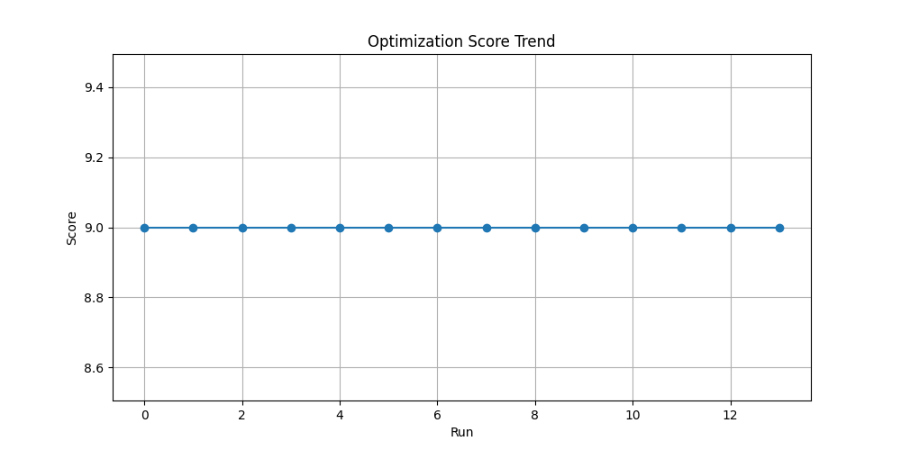
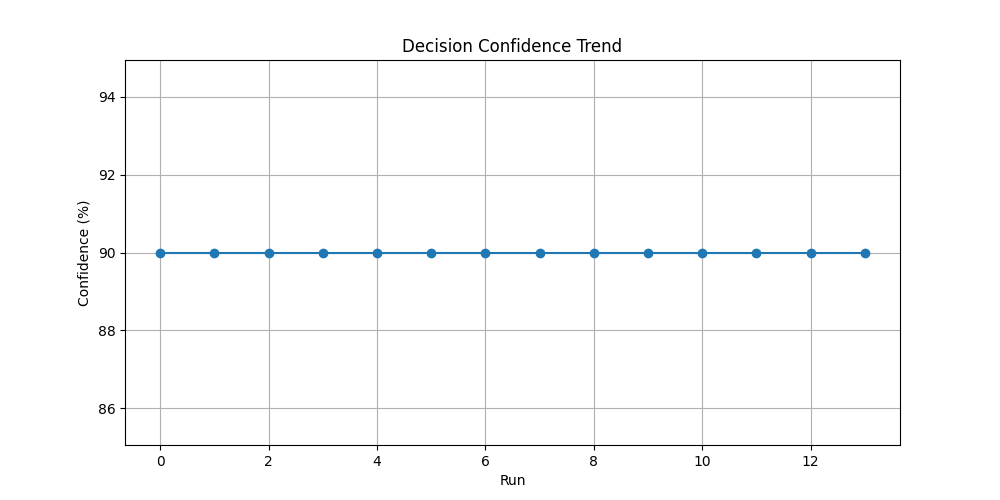
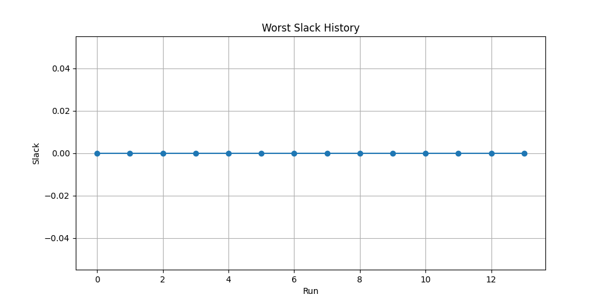

# AICO — AI-Powered RTL Optimization Framework

AICO is an adaptive RTL timing optimization platform designed to automate timing analysis, repair generation, timing closure, and explainable optimization decisions.

## Features

- RTL Parsing
- Critical Path Analysis
- Static Timing Analysis (STA)
- Auto Repair Engine
- Timing Closure Loop
- Candidate Ranking
- Decision Confidence
- Explainable Optimization
- Learning Memory
- Optimization History Dashboard

## Workflow

RTL → Parse → STA → Repair → Rank → Decide → Learn → Visualize

## Technology Stack

- Python
- PyVerilog
- NetworkX
- Matplotlib

## Future Scope

- ML-based repair prediction
- Power-aware optimization
- Multi-module support
- GUI dashboard

## Dashboard Outputs

### Optimization Score Trend

### Confidence Trend

### Slack History

